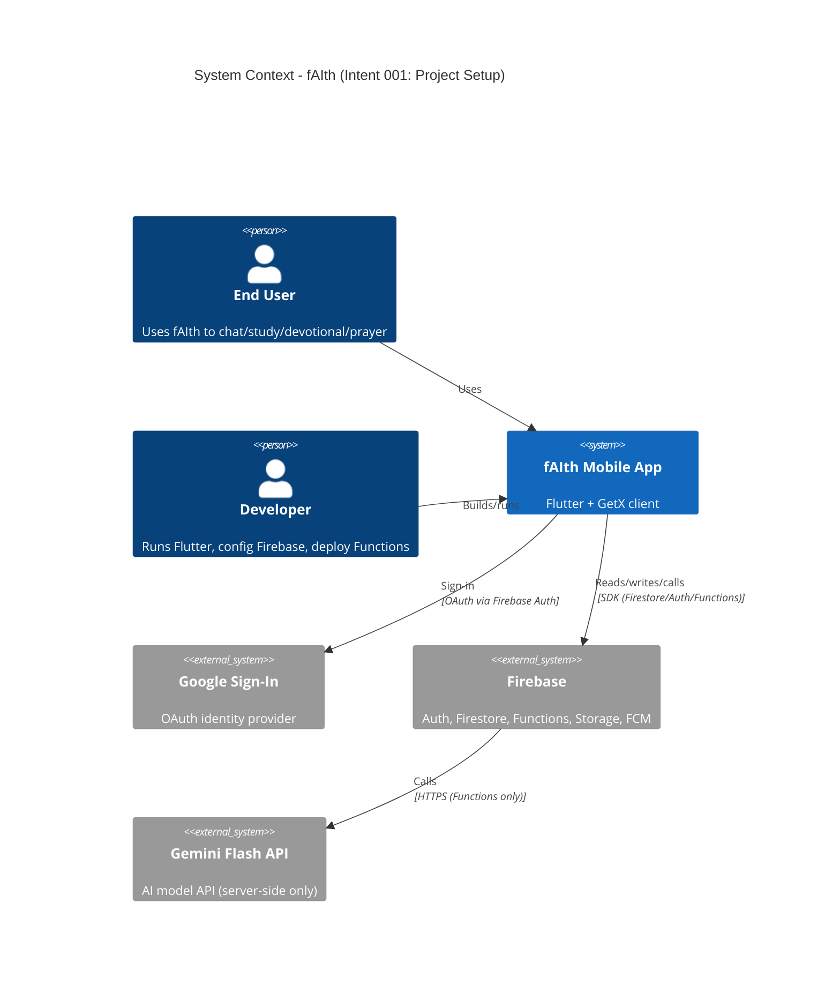

# System Context — Intent 001: Project Setup

**Intent:** 001-project-setup
**Status:** Draft
**Created:** 2026-05-20T07:10:00Z

## System Under Design
**fAIth Mobile App** (`fAIth_mobile/`) — Flutter + GetX client integrated with Firebase backend services.

## Actors
- **End User** (Human): Christian users using mobile app for chat, study, devotionals, prayers.
- **Developer** (Human): Sets up local dev, runs emulators, deploys Functions.
- **Firebase Platform** (System): Auth/Firestore/Functions/Storage/FCM runtime.

## External Systems
- **Google Sign-In** (Inbound auth): OAuth via Firebase Auth (Google provider).
- **Firestore** (Both): User profile + app data persistence.
- **Firebase Functions** (Inbound/Outbound): HTTPS callable/HTTP endpoints consumed by mobile app; later calls Gemini.
- **Firebase Storage** (Outbound): Media assets (future: user uploads).
- **Firebase Cloud Messaging** (Outbound): Push notifications (future phases).
- **Gemini Flash API** (Outbound via Functions only): AI responses; never called from client.

## Data Flows
### Inbound (to Mobile)
- User input (login taps, chat messages, prayer entries, settings changes).
- Auth state updates (Firebase Auth).
- Firestore snapshots (user doc, chat/prayer history).

### Outbound (from Mobile)
- Auth requests (Google Sign-In via Firebase).
- Reads/writes to Firestore (profile, chat_history, prayers, favorites, devotionals cache).
- Calls to Functions endpoints (AI proxy placeholder in this intent).

## Context Diagram

## Open Questions / Future Integrations
- Maps provider for Nearby Churches (Google Maps vs other) — Phase 2/3.
- Notifications rules + scheduling strategy — Phase 6.
